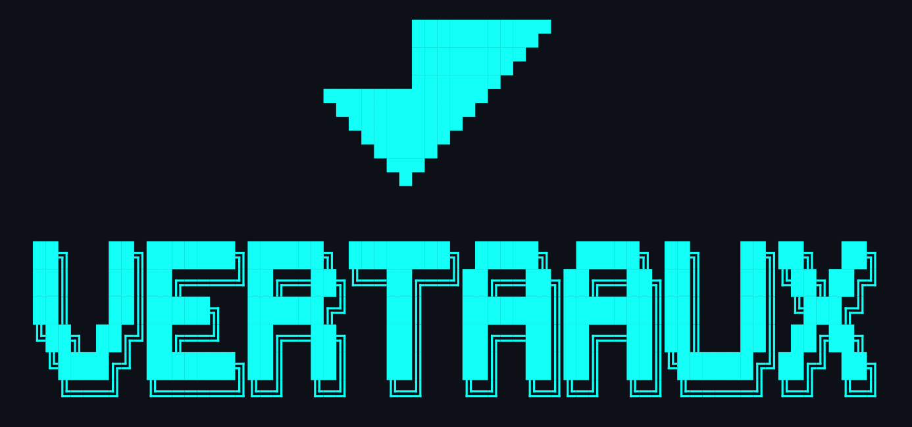

<div align="center">



**Agent skills for VertaaUX accessibility, UX and conversion audits.**

</div>

---

This repository packages VertaaUX guidance in the open [Agent Skills](https://agentskills.io/) format used by Vercel-compatible skill tooling.

## Install

```bash
npx skills add VertaaUX/agent-skills
```

List the packaged skills before installing:

```bash
npx skills add VertaaUX/agent-skills --list
```

Install only the VertaaUX skill explicitly:

```bash
npx skills add VertaaUX/agent-skills --skill vertaaux
```

## Available Skill

### `vertaaux`

Run and operationalize VertaaUX audits across CLI, CI/CD, SDK, API, and MCP.

Use it when the user needs to:

- audit a live URL for UX, accessibility, or conversion issues
- investigate WCAG findings or accessibility regressions
- set up CI or PR quality gates with thresholds and baselines
- compare audit runs and explain score deltas
- generate triage, fix plans, patch reviews, or team playbooks from audit output

## What It Covers

- CLI workflows for one-off audits and AI follow-up commands
- CI/CD setup for score thresholds, baselines, and regression detection
- SDK and API integration for automated workflows
- MCP server guidance for agent-driven integrations
- Use-case playbooks for accessibility, monitoring, remediation, and competitive review

## Quick Start

```bash
npm install -g @vertaaux/cli
vertaa login
vertaa audit https://example.com --wait
vertaa a11y https://example.com --mode deep
```

## Repository Layout

- `skills/vertaaux/SKILL.md` - Main skill instructions and routing guidance
- `skills/vertaaux/references/audit-profiles.md` - Built-in audit profiles, custom profile schema, and profile selection guidance
- `skills/vertaaux/references/cli-workflows.md` - Command reference and piping patterns
- `skills/vertaaux/references/cicd-setup.md` - CI/CD and GitHub Actions examples
- `skills/vertaaux/references/sdk-api.md` - SDK, API, webhook, and MCP details
- `skills/vertaaux/references/use-cases.md` - Task recipes and step-by-step workflow playbooks

## Compatibility

Works with Claude Code, Cursor, Codex, GitHub Copilot, Gemini CLI, Windsurf, Cline, Roo, and other tools that support the Agent Skills format.

## License

MIT
